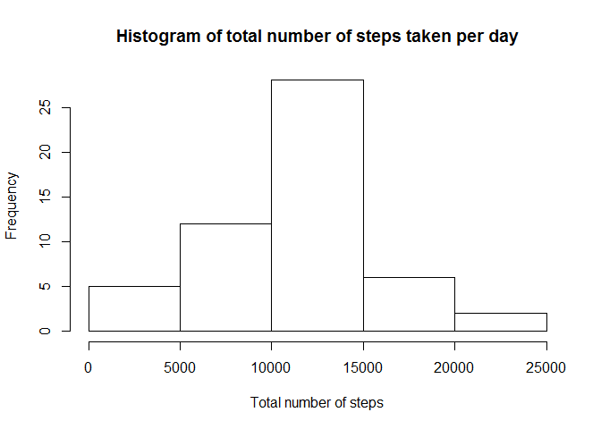
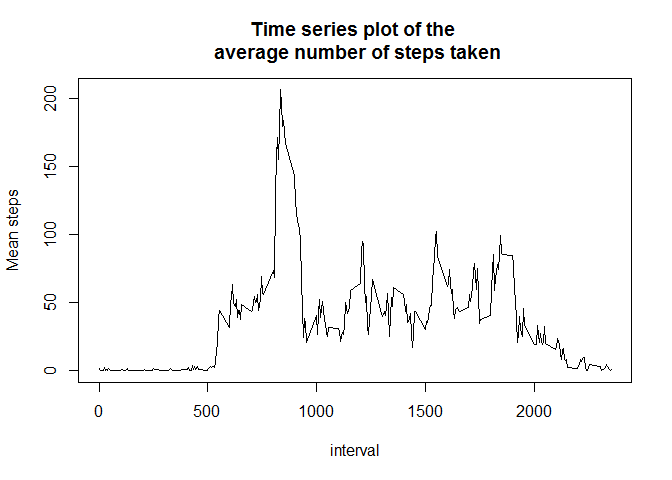
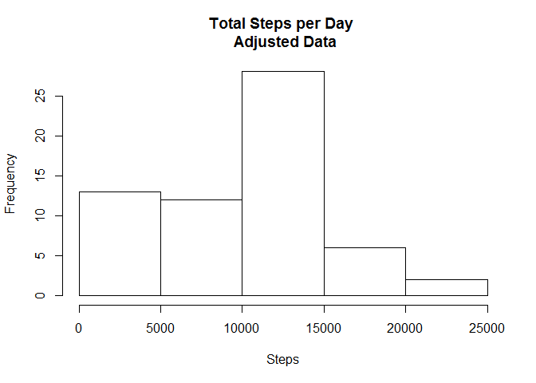

# Reproducible Research: Peer Assessment 1


## Loading and preprocessing the data

1. Load the data (i.e. read.csv())


```r
filename <- "repdata%2Fdata%2Factivity.zip"

if (!file.exists(filename)){
        fileURL <- "https://d396qusza40orc.cloudfront.net/repdata%2Fdata%2Factivity.zip"
        download.file(fileURL, filename, method="libcurl")
}  
if (!file.exists("activity.csv")) { 
        unzip(filename) 
}

if("activity.csv" %in% dir()){ 
        data <- read.csv("./activity.csv",header = TRUE) 
} 
```

2. Process/transform the data (if necessary) into a format suitable for your
analysis


```r
        data$date <- as.Date(data$date , "%Y-%m-%d")
        data <- as.data.frame(data)
        tot.n.steps.perday <-aggregate(steps ~ date, data,  FUN = sum)
        colnames(tot.n.steps.perday) <- c("days" ,"steps")
```


## What is mean total number of steps taken per day?

1. Make a histogram of the total number of steps taken each day


```r
hist(tot.n.steps.perday$steps, main = "Histogram of total number of steps taken per day", xlab = "Total number of steps")
```

<!-- -->

2. Calculate and report the mean and median total number of steps taken
per day


```r
print(paste("The mean of the total number of steps taken per day is ", mean(tot.n.steps.perday$steps),"and has a median of ", median(tot.n.steps.perday$steps)))
```

## What is the average daily activity pattern?

1. Make a time series plot (i.e. type = "l") of the 5-minute interval (x-axis)
and the average number of steps taken, averaged across all days (y-axis)


```r
Mean_steps <- aggregate(steps ~ interval, data, FUN = mean, na.rm = TRUE)
        colnames(Mean_steps) <- c("interval", "mean")
        
        plot(Mean_steps$interval, Mean_steps$mean, type = "l", main = "Time series plot of the \n average number of steps taken", xlab = "interval", ylab = "Mean steps")
```

<!-- -->

2. Which 5-minute interval, on average across all the days in the dataset,
contains the maximum number of steps?

```r
        maxsteps <- max(Mean_steps$mean)
        Maxinterval <- Mean_steps$interval[Mean_steps$mean == maxsteps]
        print(paste(Maxinterval," is the interval with maximum number of steps of ", maxsteps, " steps"))
```
## Imputing missing values
1. Calculate and report the total number of missing values in the dataset
(i.e. the total number of rows with NAs)


```r
        missingdata <- sum(is.na(data$steps))
        print(paste("There are", missingdata, "missing data points."))
```

2. Devise a strategy for filling in all of the missing values in the dataset. The
strategy does not need to be sophisticated. For example, you could use
the mean/median for that day, or the mean for that 5-minute interval, etc.

The mean used to fill missing value.

3. Create a new dataset that is equal to the original dataset but with the
missing data filled in.

```r
        betterdata <- data
        betterdata$steps[is.na(betterdata$steps)] <- median(data$steps, na.rm=TRUE)
        betterdataday <- aggregate(steps ~ date, data=betterdata, sum, na.rm=TRUE)
```
4. Make a histogram of the total number of steps taken each day and Calculate
and report the mean and median total number of steps taken per day. Do
these values differ from the estimates from the first part of the assignment?
What is the impact of imputing missing data on the estimates of the total
daily number of steps?

```r
        hist(betterdataday$steps, main="Total Steps per Day \n Adjusted Data",xlab="Steps", ylab="Frequency")
```

<!-- -->

```r
        print(paste("The mean of the total number of steps taken per day after NA is replaced is ",mean(betterdataday$steps),"and has a median of ", median(betterdataday$steps)))                
```
The mean and median has changed, and has made the histogram to skew

## Are there differences in activity patterns between weekdays and weekends?
1. Create a new factor variable in the dataset with two levels – “weekday”
and “weekend” indicating whether a given date is a weekday or weekend
day.


```r
        betterdata$date <- as.Date(betterdata$date)
        betterdata$dayname <- weekdays(betterdata$date)
        betterdata$weekend <- as.factor(ifelse(betterdata$dayname == "Saturday" |
                                                       betterdata$dayname == "Sunday", "weekend", "weekday"))
```
2. Make a panel plot containing a time series plot (i.e. type = "l") of the
5-minute interval (x-axis) and the average number of steps taken, averaged
across all weekday days or weekend days (y-axis). The plot should look
something like the following, which was creating using simulated data:


```r
        library(lattice)
        plotdata <- aggregate(steps ~ interval + weekend, betterdata, mean)
        xyplot(steps ~ interval | factor(weekend), data=plotdata, aspect=1/3, type="l")
```

<!-- -->
